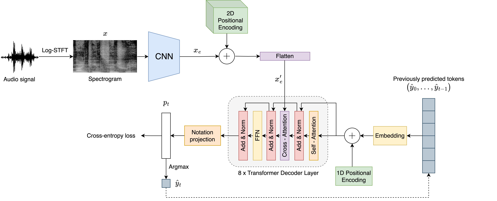

<p align='center'>
  <a href=''></a>
</p>

<h1 align='center'>A Transformer Approach For Polyphonic Audio-To-Score Transcription</h1>

<h4 align='center'>Full text coming soon<a href='' target='_blank'></a>.</h4>

<p align='center'>
  
  
  
  
</p>

<p align='center'>
  <a href='#about'>About</a> •
  <a href='#how-to-use'>How To Use</a> •
  <a href='#citations'>Citations</a> •
  <a href='#acknowledgments'>Acknowledgments</a> •
  <a href='#license'>License</a>
</p>

## About

End-to-end Audio-to-Score (A2S) transcription aims to derive a score that represents the music content of an audio recording in a single step. While current state-of-the-art methods, which rely on Convolutional Recurrent Neural Networks trained with the Connectionist Temporal Classification loss function, have shown promising results under constrained circumstances, these approaches still exhibit fundamental limitations, especially when dealing with complex sequence modeling tasks, such as polyphonic music. 

To address the aforementioned conditions, **we introduce an alternative learning scheme based on a Transformer decoder, specifically tailored for A2S by incorporating a two-dimensional positional encoding to preserve frequency-time relationships when processing the audio signal**.

<p align="center">
  
</p>

## How To Use

We consider the *Quartets* collection that comprises three datasets of string quartets by Haydn, Mozart, and Beethoven. This collection is available upon [request](mailto:malfaro@dlsi.ua.es) and must be placed in the main [`repository`](.) folder to be able to replicate our experiments. 

Furthermore, you'll need to meet certain requirements which are specified in the [`Dockerfile`](Dockerfile) to run the code. Alternatively, you can set up a virtual environment if preferred.

Once you have prepared your environment (either a Docker container or a virtual environment), you are ready to begin. Execute the [`run_exps.sh`](run_exps.sh) script to replicate the experiments from our work:
```bash
$ sh run_exps.sh
```

## Citations

```bibtex
@inproceedings{alfaro2024transformer,
  title     = {{A Transformer Approach For Polyphonic Audio-To-Score Transcription}},
  author    = {Alfaro-Contreras, Mar{\'\i}a and R{\'\i}os-Vila, Antonio and Valero-Mas, Jose J and Calvo-Zaragoza, Jorge},
  booktitle = {{Proceedings of the 49th International Conference on Acoustics, Speech and Signal Processing}},
  year      = {2024},
  publisher = {IEEE},
  address   = {Seoul, Korea},
  month     = {apr},
}
```

## Acknowledgments

This work is part of the I+D+i PID2020-118447RA-I00 ([MultiScore](https://sites.google.com/view/multiscore-project)) project, funded by MCIN/AEI/10.13039/501100011033. Computational resources were provided by the Valencian Government and FEDER funding through IDIFEDER/2020/003.

## License

This work is under a [MIT](LICENSE) license.